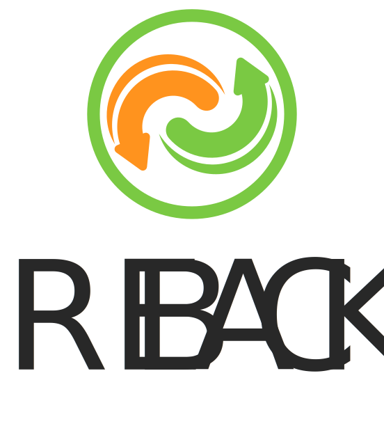

# Napkin Tools: ReBack (Restore/Backup Utility)


## [Русская версия](./README-RU.md)

  

This utility is designed for server users who need to regularly create backups of databases (PostgreSQL, MongoDB, and
MySQL) and directories. ReBack supports saving backups both locally and in S3-compatible storage, organizing them in a
convenient structure, and automatically tracking their retention period.

Additionally, ReBack supports restoring backups from S3 storage to the elements specified in the configuration.

## Table of contents

- [Features](#features)
- [Requirements](#requirements)
- [Download](#download)
    - [Option 1: Download from Releases](#option-1-download-from-releases)
    - [Option 2: Build Locally](#option-2-build-locally)
- [Configuration](#configuration)
    - [Required Parameters](#required-parameters)
    - [Elements for Backup/Restoration](#elements-for-backuprestoration)
        - [Available Element Types and Their Parameters](#available-element-types-and-their-parameters)
        - [Common Parameters for All Elements](#common-parameters-for-all-elements)
- [Usage](#usage)
    - [Backup](#backup)
        - [Cron Task](#cron-task)
    - [Restore Backup](#restore-backup)
        - [Restore All Backups](#restore-all-backups)
        - [Restore Specific Elements](#restore-specific-elements)
- [Author](#author)
- [Support](#support)
- [License](#license)

## Features

- Support for backing up PostgreSQL, MongoDB and MySQL, both locally installed and in Docker containers.
- Backup of local directories.
- Saving backups locally and in S3-compatible storage.
- Organizing backups in subdirectories based on element names specified in the configuration.
- Generating backup file names based on the element name and creation time.
- Logging all process steps to a file with rotation upon reaching 10MB.
- Configuration via the `settings.json` file.
- Restoration of backups from S3 storage.

## Requirements

- Installed Docker (for saving/restoring from containers).
- S3-compatible storage (for remote saving/restoring of backups).

## Download

### Option 1: Download from Releases

1. Download the latest version from the [releases page](https://github.com/proDreams/reback/releases/latest) or use
   `wget/curl`:
    ```bash
    # Linux
    wget https://github.com/proDreams/reback/releases/download/v0.3.1/reback_linux -O reback
    
    # macOS Intel
    wget https://github.com/proDreams/reback/releases/download/v0.3.1/reback_macos_intel -O reback
    
    # macOS ARM
    wget https://github.com/proDreams/reback/releases/download/v0.3.1/reback_macos_aarch -O reback
    
    # Windows
    curl -L -o reback.exe https://github.com/proDreams/reback/releases/download/v0.3.1/reback.exe
    ```

2. **For Linux and macOS**: Make the file executable by running the following command:

    ```bash
    chmod +x reback
    ```

3. Create and configure `settings.json`. For more details, see [Configuration](#configuration).

### Option 2: Build Locally

If you want to build the application yourself, follow these steps:

**Requirements:**

- [Installed Rust](https://www.rust-lang.org/tools/install) (recommended version: `rustc 1.83.0`).
- Rust toolchain manager: `rustup 1.27.1` or higher.

1. Clone the repository:

    ```bash
    git clone https://github.com/proDreams/reback.git
    cd reback
    ```

2. Build the application in release mode:

    ```bash
    cargo build --release
    ```

3. **For Linux and macOS**. Make the binary executable:

    ```bash
    chmod +x target/release/reback
    ```
4. The executable file is located in the `target/release/reback` directory.

5. Create and configure `settings.json`. For more details, see [Configuration](#configuration).

## Configuration

The application is configured through the `settings.json` file.

**Attention!** The `settings.json` file must be in the same directory as the executable file!

1. Download the configuration template file:
    ```bash
    # Linux and macOS
    wget https://raw.githubusercontent.com/proDreams/reback/main/settings.json.example -O settings.json

    # Windows
    curl -L -o settings.json https://raw.githubusercontent.com/proDreams/reback/main/settings.json.example
    ```
2. Open the file for editing:
    ```bash
    # Linux and macOS
    nano settings.json
    
    # Windows
    notepad settings.json
    ```

3. Configure the file for your environment and save it.

### Required parameters

```json
{
  "s3_endpoint": "https://s3.example.com",
  "s3_region": "us-east-1",
  "s3_bucket": "my-bucket",
  "s3_access": "access-key",
  "s3_secret": "secret-key",
  "s3_path_style": "path",
  "backup_dir": "/tmp/backups",
  "elements": []
}
```

- **s3_endpoint**: URL of your S3-compatible storage.
- **s3_region**: Region of your S3 storage.
- **s3_bucket**: The name of the S3 bucket where backups will be saved.
- **s3_access**: Access key for connecting to S3.
- **s3_secret**: Secret key for connecting to S3.
- **s3_path_style**: Specifies the path style for S3 (e.g., "path" or "virtual-host").
- **backup_dir**: Absolute path to the directory where local backups will be stored. If the directory doesn't exist, it
  will be created automatically.
- **elements**: An array of objects, each representing an element for backup (e.g., a database or directory).

### Elements for Backup/Restoration:

A customizable list of elements for backup/restore.

Example of an element:

```json
{
  "element_title": "my_pg_db",
  "s3_folder": "postgres_backups",
  "backup_retention_days": 30,
  "s3_backup_retention_days": 90,
  "params": {
    "type": "postgresql",
    "db_host": "localhost",
    "db_port": 5432,
    "db_name": "my_database",
    "db_user": "user",
    "db_password": "password"
  }
}
```

#### Available element types and their parameters:

- `postgresql` — Backup of a PostgreSQL database.
- `postgresql_docker` — Backup of a PostgreSQL database from a Docker container.
- `mongodb` — Backup of a MongoDB database.
- `mongodb_docker` — Backup of a MongoDB database from a Docker container.
- `mysql` — Backup of a MySQL database.
- `mysql_docker` — Backup of a MySQL database from a Docker container.
- `folder` — Backup of a local directory.

| Element Type          | Parameter          | Description                                   | Required |
|-----------------------|--------------------|-----------------------------------------------|----------|
| **postgresql**        | `db_host`          | Database host. Default: `localhost`.          | Optional |  
|                       | `db_port`          | Port for connection.                          | Required |  
|                       | `db_name`          | Name of the database.                         | Required |  
|                       | `db_user`          | Database user.                                | Required |  
|                       | `db_password`      | User password.                                | Required |  
|                       |                    |                                               |          |  
| **postgresql_docker** | `docker_container` | Name of the Docker container with PostgreSQL. | Required |  
|                       | `db_name`          | Name of the database.                         | Required |  
|                       | `db_user`          | Database user.                                | Required |  
|                       | `db_password`      | User password.                                | Required |  
|                       |                    |                                               |          |  
| **mongodb**           | `db_host`          | Database host. Default: `localhost`.          | Optional |  
|                       | `db_port`          | Port for connection.                          | Required |  
|                       | `db_user`          | Database user.                                | Optional |  
|                       | `db_password`      | User password.                                | Optional |  
|                       |                    |                                               |          |  
| **mongodb_docker**    | `docker_container` | Name of the Docker container with MongoDB.    | Required |  
|                       | `db_user`          | Database user.                                | Optional |  
|                       | `db_password`      | User password.                                | Optional |  
|                       |                    |                                               |          |  
| **mysql**             | `db_host`          | Database host. Default: `localhost`.          | Optional |  
|                       | `db_port`          | Port for connection.                          | Required |  
|                       | `db_name`          | Name of the database.                         | Required |  
|                       | `db_user`          | Database user.                                | Required |  
|                       | `db_password`      | User password.                                | Required |  
|                       |                    |                                               |          |  
| **mysql_docker**      | `docker_container` | Name of the Docker container with MySQL.      | Required |  
|                       | `db_name`          | Name of the database.                         | Required |  
|                       | `db_user`          | Database user.                                | Required |  
|                       | `db_password`      | User password.                                | Required |  
|                       |                    |                                               |          |  
| **folder**            | `target_path`      | Path to the directory to be backed up.        | Required |  

#### Common Parameters for All Elements:

| Parameter                    | Description                                                 |
|------------------------------|-------------------------------------------------------------|
| **element_title**            | Name of the element (used in the directory and file names). |
| **s3_folder**                | Folder in S3 for storing backups.                           |
| **backup_retention_days**    | Number of days to retain local backups.                     |
| **s3_backup_retention_days** | Number of days to retain backups in S3.                     |

## Usage

### Backup

To start the backup process, run the following command:

```bash
./reback backup
```

**Important**: The `backup` argument is required to start the backup process. Without it, the program will not run, and
you will get an error.

#### Cron Task

You can automate the backup process by creating a Cron job. For example, to run the backup every day at 2:00 AM, add the
following line to your crontab file:

```bash
0 2 * * * /path/to/reback backup
```

This Cron job will:

- Run the `./reback backup` command every day at 2:00 AM.

To edit the crontab, use the command:

```bash
crontab -e
```

Then, add the Cron job line. Make sure the path to the `reback` binary is correct.

### Restore Backup

There are two options for restoring backups:

#### Restore All Backups

1. Make sure you have a configured `settings.json` file with descriptions of all the required elements.
2. Run the command to start the restoration:

    ```bash
    ./reback restore
    ```

#### Restore Specific Elements

1. Make sure you have a configured `settings.json` file with descriptions of all the required elements.
2. Run the command to start the restoration:

    ```bash
    # Template
    ./reback restore <element_title1> <element_title2>
    
    # Example
    ./reback restore my_pg_db image_folder mongo_site
    ```
   
## Author

Program author: Ivan Ashikhmin  
Telegram for contact: [https://t.me/proDreams](https://t.me/proDreams)

The program was created as part of the "Code on a Napkin" project.

- Website: [https://pressanybutton.ru/](https://pressanybutton.ru/)
- Telegram channel: [https://t.me/press_any_button](https://t.me/press_any_button)

## Support

If you like this project and want to support its further development, consider donating:

- Donation via TON: `UQBU8rJEfUcBvJUbz6NbXiWxaOO_NoXHK_pXOWv7qsOBWbFp`
- [Support on Boosty](https://boosty.to/prodream)
- [In our Telegram bot for Telegram Stars](https://t.me/press_any_button_bot?start=donate)

Your support helps the project grow and improve future features!

## License

This project is licensed under the MIT License. Details can be found in the [LICENSE](LICENSE) file.